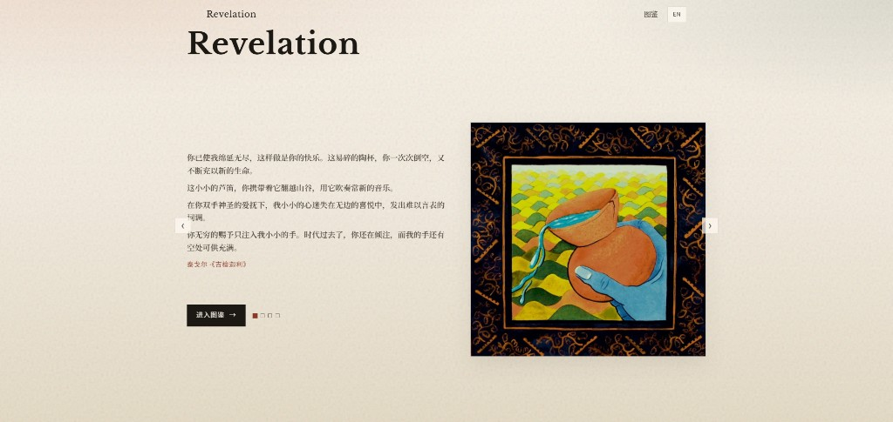
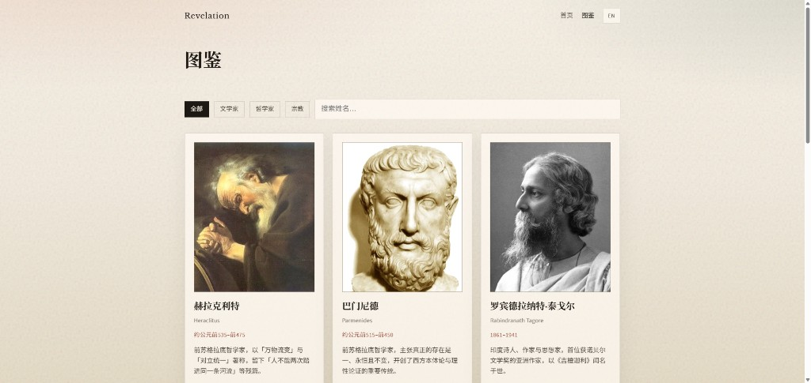
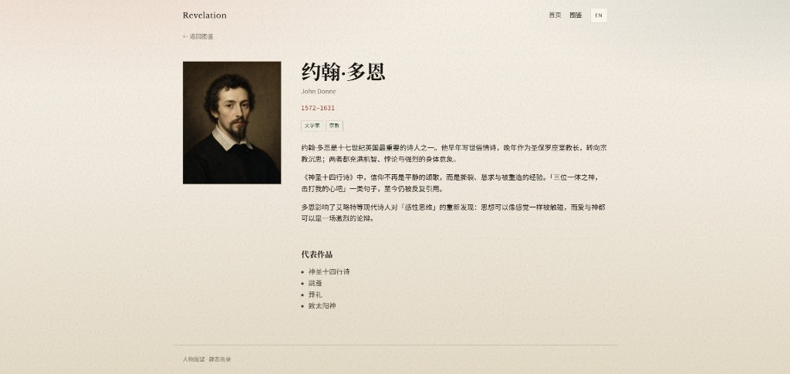

# Revelation

中英双语的静态人物图鉴：把历史上的文学家、哲学家与宗教思想者收进同一处可浏览的档案。站点以 Astro 构建，部署于 GitHub Pages，无需后端。

**在线预览：** <https://water43.github.io/revelation/>

## 它是什么

Revelation 不是百科词条的堆叠，而是一份偏人文气质的「图鉴」：

- **首页**：一屏内轮播诗句与配图（泰戈尔《吉檀迦利》、多恩《神圣十四行诗》等），保留品牌与「进入图鉴」入口，尽量避免滚动。
- **图鉴列表**：按文学家 / 哲学家 / 宗教筛选，支持姓名搜索；卡片展示肖像、生卒与简介。
- **人物详情**：肖像、分类标签、正文介绍与代表作品。
- **中 / 英**：路由前缀 `/zh/`、`/en/`，导航可切换语言；人物条目分目录维护，共用 `slug`。

当前收录包括文学家、哲学家，以及泰勒、戴明、福特、爱迪生、钱学森、茅以升、布鲁内尔等工程—系统—管理谱系人物（持续扩充）。
图鉴筛选新增「工程」分类；若无肖像文件，则显示姓名首字母默认头像。

## 界面预览

### 首页 · 诗文轮播

一屏展示品牌、诗句与配图，可左右切换或自动轮播。



### 图鉴列表

分类筛选与搜索，卡片展示肖像与简介。



### 人物详情

肖像、标签、介绍与代表作品。



## 技术栈

- Astro（纯静态输出）
- Markdown Content Collections（人物内容）
- 原生 CSS + 轻量客户端脚本（首页轮播、列表筛选）
- GitHub Actions → GitHub Pages

## 本地开发

```bash
npm install
npm run dev
```

```bash
npm run build
npm run preview
```

构建产物在 `dist/`。

## 新增人物

1. 在 `src/content/figures/zh/` 与 `en/` 各添加同名 Markdown。
2. Frontmatter 使用相同 `slug`，并填写 `name`、`nameAlt`、`era`、`categories`、`summary`、`works`、`order`。
3. 肖像放入 `public/portraits/{slug}.jpg`。
4. 正文用 Markdown 撰写简介。

`categories` 可选：`literary` | `philosopher` | `religion`。

## 首页诗文

诗句与配图在 [`src/i18n/ui.ts`](src/i18n/ui.ts) 的 `poems` 数组中配置；图片放在 `public/home/`。

## 目录结构（简要）

```
src/
  content/figures/{zh,en}/   # 人物 Markdown
  pages/[locale]/             # 首页、图鉴列表与详情
  i18n/ui.ts                 # UI 文案与首页诗句
  styles/global.css
public/
  portraits/                 # 人物头像
  home/                      # 首页配图
```

## 许可说明

人物肖像多来自 Wikimedia Commons 等公有领域来源；诗文原文请注意各自版权状态。站点代码以本仓库为准。
